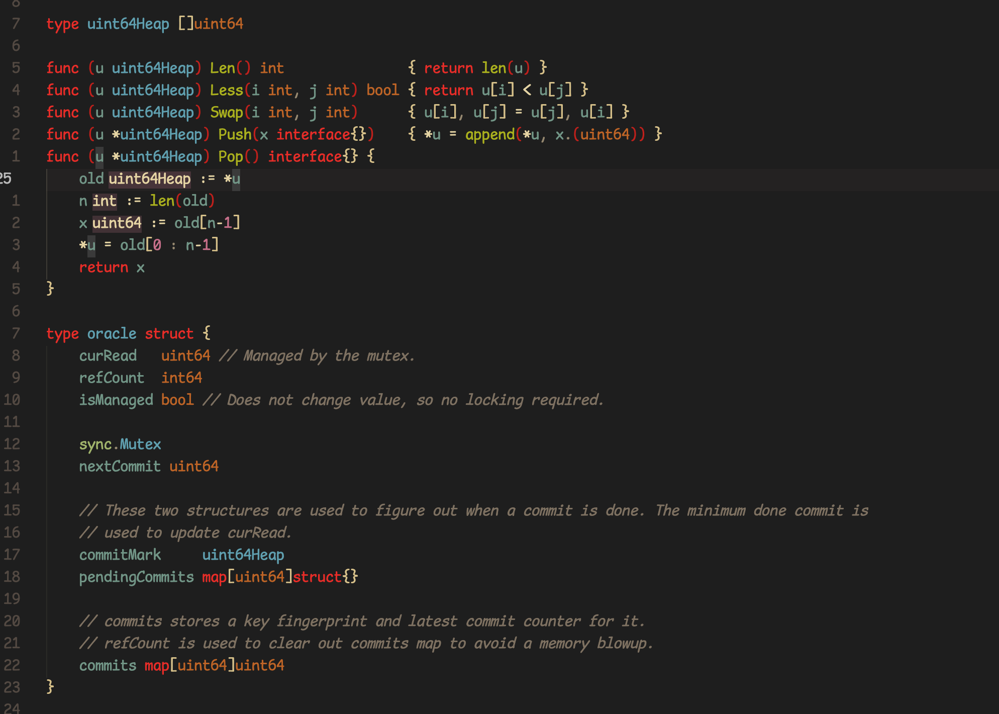

Another gruvbox theme optimized for go, it based on https://github.com/anhoder/vscode-theme-gruvbox.

github repo: https://github.com/anhoder/vscode-theme-gruvbox

### Notice

**Make sure `ui.semanticTokens`` is turned on!**

```json
"gopls": {  
  "ui.semanticTokens": true
}
```

### Preview 


